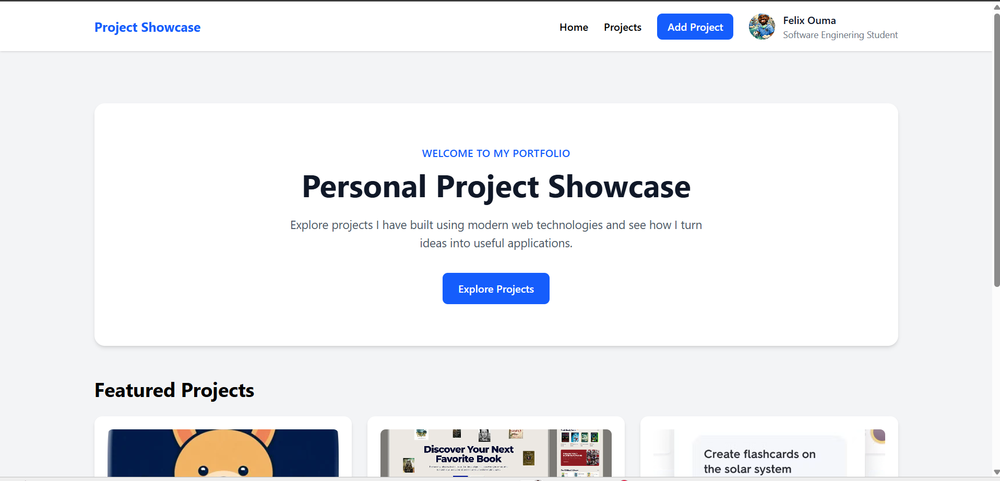

# Personal Project Showcase App

A React-based Single Page Application (SPA) for showcasing and managing personal software development projects.

This application was developed as part of the **Moringa School React-Based Summative Assessment**. It demonstrates modern frontend development practices including React hooks, state management, reusable components, client-side routing, API data fetching, CRUD operations, dynamic search, responsive design, and automated testing.

---

## Application Preview



---

## Project Overview

The Personal Project Showcase App allows users to view and manage a collection of software development projects.

The application provides:

- A landing page introducing the project showcase
- Featured projects
- A complete projects listing
- Dynamic project search
- Project details
- Adding new projects
- Editing existing projects
- Deleting projects
- GitHub and live project links
- Responsive navigation and layouts

Project data is stored and persisted using **JSON Server** as a simulated backend.

---

## Features

- Responsive personal project showcase
- Landing page with featured projects
- View all projects
- Dynamic project search
- View detailed project information
- Add a new project
- Edit an existing project
- Delete a project
- Project categories
- Featured project status
- GitHub project links
- Live project links
- User information displayed through React Context
- Reusable React components
- Client-side routing
- Custom React hook for project management
- Simulated backend using JSON Server
- Automated component and interaction testing

---

## Technologies Used

- **React** — Building the user interface
- **Vite** — Development server and build tool
- **JavaScript** — Application logic
- **Tailwind CSS** — Responsive styling
- **React Router** — Client-side routing
- **JSON Server** — Simulated backend
- **Vitest** — Testing framework
- **React Testing Library** — Component and interaction testing
- **Git** — Version control
- **GitHub** — Repository hosting

# Setup and Installation

## Prerequisites

Before running the application, make sure the following software is installed:

- Node.js
- npm
- Git

You can verify the installations using:

```bash
node --version
npm --version
git --version
```

---

## 1. Clone the Repository

Clone the project from GitHub:

```bash
git clone https://github.com/felixouma10/personal-project-showcase-app
```

Navigate into the project directory:

```bash
cd personal-project-showcase-app
```

---

## 2. Install Dependencies

Install all required project dependencies:

```bash
npm install
```

This installs the dependencies defined in `package.json`.

---

## 3. Start JSON Server

The application uses **JSON Server** as a simulated backend.

Start the server using:

```bash
npm run server
```

The server will normally run at:

```text
http://localhost:3000
```

The available API endpoints are:

```text
http://localhost:3000/user
http://localhost:3000/projects
```

Keep this terminal running while using the application.

---

## 4. Start the React Development Server

Open a **second terminal** in the project directory.

Run:

```bash
npm run dev
```

Vite will normally make the application available at:

```text
http://localhost:5173
```

Open the URL displayed by Vite in your browser.

---

# Using the Application

Once both the JSON Server and React development server are running, the application can be used through the browser.

### Home Page

The home page introduces the Personal Project Showcase and displays featured projects.

### Projects Page

Navigate to `/projects` to view all available projects.

### Search Projects

Use the search bar to dynamically search projects.

Projects can be searched using information such as:

- Project title
- Description
- Category
- Technologies

### View Project Details

Select a project to view its complete information.

The details page displays information such as:

- Project title
- Description
- Category
- Technologies
- Project image
- GitHub URL
- Live project URL

### Add a Project

Navigate to:

```text
/projects/new
```

Complete the project form and submit it to create a new project.

### Edit a Project

Open a project and select the edit option.

The application loads the existing project information into the form, allowing the administrator to modify the project.

### Delete a Project

Projects can be deleted from the project interface after confirming the deletion.

# Testing

The application uses:

- **Vitest**
- **React Testing Library**
- **jest-dom**

The tests cover important components, application functionality, user interactions, routing, forms, project operations, and the custom project hook.

## Run Tests

Run the test suite using:

```bash
npm test
```

# Production Build

The application can be built for production using:

```bash
npm run build
```

The production build has been successfully tested during development.

---

# Future Improvements

Possible future improvements include:

- User authentication and authorization
- Image upload functionality
- Advanced project filtering
- Pagination for larger project collections
- Deployment with a production backend
- Improved accessibility features
- Project analytics
- Cloud database integration
- Improved form validation
- Notifications for successful and failed operations

---

# Author

**Felix Ouma**
**Student-Moringa School**
